# Documento de Diseño: Conectividad de Infraestructura Docker

## Visión General

Este diseño describe las modificaciones necesarias al archivo `docker/docker-compose.yaml` y la creación de un archivo `README.md` para mejorar la conectividad entre servicios en la infraestructura Docker Compose del proyecto MLOps.

Los cambios principales son:
1. Agregar MySQL como dependencia explícita de Airflow en el bloque `x-airflow-common` con condición `service_healthy`.
2. Configurar el servicio Jupyter con variables de entorno y dependencias hacia MySQL y MinIO.
3. Agregar un healthcheck al servicio Jupyter.
4. Limpiar los volúmenes no declarados de Jupyter (`shared_models`, `shared_report`, `shared_data`, `shared_results`) y reemplazarlos con bind mounts.
5. Agregar un nuevo servicio MinIO con healthcheck, puertos y volumen persistente.
6. Configurar el servicio penguin-api con variables de entorno y dependencia hacia MinIO.
7. Crear un archivo `README.md` documentando la arquitectura completa.

### Reglas de Conectividad

| Servicio Origen | Servicio Destino | Tipo de Acceso |
|----------------|-----------------|----------------|
| Airflow (todos) | MySQL | Lectura/Escritura (AIRFLOW_CONN_MYSQL_DEFAULT) |
| Jupyter | MySQL | Lectura |
| Jupyter | MinIO | Lectura/Escritura |
| Penguin_API | MinIO | Lectura/Escritura |

### Decisiones de Diseño

- Se utiliza el bloque YAML anchor `x-airflow-common` existente para propagar la dependencia de MySQL a todos los servicios de Airflow, evitando duplicación.
- Las variables de entorno de Jupyter y penguin-api usan nombres de host internos de Docker (`mysql`, `minio`) para la comunicación entre contenedores.
- MinIO se configura con un healthcheck basado en su endpoint nativo `/minio/health/live`.
- Se declara un volumen nombrado `minio_data` para persistencia de datos de MinIO.
- Los volúmenes no declarados de Jupyter (`shared_models`, `shared_report`, `shared_data`, `shared_results`) se reemplazan con bind mounts relativos al contexto del proyecto.
- Jupyter recibe un healthcheck basado en `curl` al puerto 8888.

## Arquitectura

### Diagrama de Conectividad de Servicios

```mermaid
graph TD
    subgraph Airflow
        AW[airflow-webserver]
        AS[airflow-scheduler]
        AWK[airflow-worker]
        AT[airflow-triggerer]
    end

    PG[postgres]
    RD[redis]
    MY[mysql]
    MN[minio]
    JP[jupyter]
    API[penguin-api]

    AW -->|depends_on: service_healthy| PG
    AS -->|depends_on: service_healthy| PG
    AWK -->|depends_on: service_healthy| PG
    AT -->|depends_on: service_healthy| PG

    AW -->|depends_on: service_healthy| RD
    AS -->|depends_on: service_healthy| RD
    AWK -->|depends_on: service_healthy| RD
    AT -->|depends_on: service_healthy| RD

    AW -->|depends_on: service_healthy| MY
    AS -->|depends_on: service_healthy| MY
    AWK -->|depends_on: service_healthy| MY
    AT -->|depends_on: service_healthy| MY

    JP -->|depends_on: service_healthy| MY
    JP -->|depends_on: service_healthy| MN

    API -->|depends_on: service_healthy| MN

    AW -.->|AIRFLOW_CONN_MYSQL_DEFAULT| MY
    JP -.->|MYSQL_HOST, MYSQL_PORT...| MY
    JP -.->|MINIO_ENDPOINT, MINIO_ACCESS_KEY...| MN
    API -.->|MINIO_ENDPOINT, MINIO_ACCESS_KEY...| MN
```



### Flujo de Arranque

1. `postgres`, `redis`, `mysql` y `minio` arrancan en paralelo.
2. Cada servicio ejecuta su healthcheck hasta reportar estado saludable.
3. `airflow-init` arranca cuando `postgres`, `redis` y `mysql` están saludables.
4. Los servicios de Airflow (webserver, scheduler, worker, triggerer) arrancan tras `airflow-init`.
5. `jupyter` arranca cuando `mysql` y `minio` están saludables.
6. `penguin-api` arranca cuando `minio` está saludable.

## Componentes e Interfaces

### 1. Modificación del bloque `x-airflow-common`

**Archivo:** `docker/docker-compose.yaml`

Se agrega `mysql` al anchor `&airflow-common-depends-on`:

```yaml
depends_on:
  &airflow-common-depends-on
  redis:
    condition: service_healthy
  postgres:
    condition: service_healthy
  mysql:
    condition: service_healthy
```

**Justificación:** Al agregar MySQL al bloque compartido, todos los servicios de Airflow que usan `<<: *airflow-common-depends-on` heredan automáticamente la dependencia. Esto es consistente con el patrón existente para postgres y redis.

### 2. Nuevo servicio MinIO

**Archivo:** `docker/docker-compose.yaml`

```yaml
minio:
  image: minio/minio
  command: server /data --console-address ":9001"
  ports:
    - "9000:9000"
    - "9001:9001"
  environment:
    MINIO_ROOT_USER: minio_user
    MINIO_ROOT_PASSWORD: minio_password
  volumes:
    - minio_data:/data
  healthcheck:
    test: ["CMD", "curl", "-f", "http://localhost:9000/minio/health/live"]
    interval: 10s
    timeout: 5s
    retries: 5
    start_period: 10s
  restart: always
```

**Interfaz expuesta:**
- Puerto `9000`: API S3 compatible
- Puerto `9001`: Consola web de administración
- Healthcheck: `GET /minio/health/live` en puerto 9000

### 3. Modificación del servicio Jupyter

**Archivo:** `docker/docker-compose.yaml`

Se agregan variables de entorno, dependencias, healthcheck y se reemplazan volúmenes no declarados con bind mounts:

```yaml
jupyter:
  build:
    context: ..
    dockerfile: jupyter/Dockerfile
  ports:
    - "8888:8888"
  volumes:
    - ../models:/app/models
    - ../report:/app/report
    - ../data:/app/data
    - ../results:/app/results
  environment:
    - JUPYTER_TOKEN=mlops12345
    - MYSQL_HOST=mysql
    - MYSQL_PORT=3306
    - MYSQL_USER=user
    - MYSQL_PASSWORD=user1234
    - MYSQL_DATABASE=mydatabase
    - MINIO_ENDPOINT=minio:9000
    - MINIO_ACCESS_KEY=minio_user
    - MINIO_SECRET_KEY=minio_password
  depends_on:
    mysql:
      condition: service_healthy
    minio:
      condition: service_healthy
  healthcheck:
    test: ["CMD-SHELL", "curl -f http://localhost:8888/api/status || exit 1"]
    interval: 30s
    timeout: 10s
    retries: 5
    start_period: 30s
  restart: always
```

**Cambios clave:**
- Volúmenes `shared_models`, `shared_report`, `shared_data`, `shared_results` reemplazados por bind mounts (`../models`, `../report`, `../data`, `../results`).
- Healthcheck agregado usando el endpoint `/api/status` de Jupyter.
- Variables de entorno para MySQL y MinIO agregadas.
- `depends_on` con `service_healthy` para MySQL y MinIO.

### 4. Modificación del servicio penguin-api

**Archivo:** `docker/docker-compose.yaml`

Se agregan variables de entorno de MinIO y dependencia:

```yaml
penguin-api:
  build:
    context: ..
    dockerfile: docker/api/Dockerfile
  ports:
    - "8989:8000"
  volumes:
    - models_data:/app/models
  environment:
    MODELS_DIR: /app/models
    MINIO_ENDPOINT: minio:9000
    MINIO_ACCESS_KEY: minio_user
    MINIO_SECRET_KEY: minio_password
  depends_on:
    minio:
      condition: service_healthy
  healthcheck:
    test: ["CMD-SHELL", "python -c \"import urllib.request; urllib.request.urlopen('http://localhost:8000/health')\""]
    interval: 30s
    timeout: 10s
    retries: 5
    start_period: 15s
  restart: always
```

**Cambios clave:**
- Variables de entorno `MINIO_ENDPOINT`, `MINIO_ACCESS_KEY`, `MINIO_SECRET_KEY` agregadas.
- `depends_on` con `service_healthy` para MinIO.

### 5. Volúmenes actualizados

Se agrega `minio_data` y se eliminan las referencias a volúmenes no declarados:

```yaml
volumes:
  postgres-db-volume:
  mysql_data:
  models_data:
  minio_data:
```

**Nota:** Los volúmenes `shared_models`, `shared_report`, `shared_data` y `shared_results` que Jupyter referenciaba nunca estuvieron declarados. Se reemplazan por bind mounts relativos al directorio del proyecto.

### 6. Archivo README

**Archivo:** `docker/README.md`

Contenido estructurado con:
- Descripción general de la infraestructura
- Tabla de servicios con puertos y propósito
- Diagrama de conectividad (Mermaid)
- Reglas de conectividad entre servicios
- Variables de entorno por servicio
- Instrucciones de uso (`docker compose up`, `docker compose down`, etc.)

## Modelos de Datos

Este diseño no introduce modelos de datos nuevos. Los cambios son exclusivamente de configuración de infraestructura Docker Compose.

### Configuración de Variables de Entorno

| Servicio | Variable | Valor | Propósito |
|----------|----------|-------|-----------|
| Jupyter | `MYSQL_HOST` | `mysql` | Hostname del servicio MySQL en la red Docker |
| Jupyter | `MYSQL_PORT` | `3306` | Puerto de MySQL |
| Jupyter | `MYSQL_USER` | `user` | Usuario de la base de datos |
| Jupyter | `MYSQL_PASSWORD` | `user1234` | Contraseña del usuario |
| Jupyter | `MYSQL_DATABASE` | `mydatabase` | Nombre de la base de datos |
| Jupyter | `MINIO_ENDPOINT` | `minio:9000` | Endpoint de la API S3 de MinIO |
| Jupyter | `MINIO_ACCESS_KEY` | `minio_user` | Clave de acceso de MinIO |
| Jupyter | `MINIO_SECRET_KEY` | `minio_password` | Clave secreta de MinIO |
| Penguin_API | `MINIO_ENDPOINT` | `minio:9000` | Endpoint de la API S3 de MinIO |
| Penguin_API | `MINIO_ACCESS_KEY` | `minio_user` | Clave de acceso de MinIO |
| Penguin_API | `MINIO_SECRET_KEY` | `minio_password` | Clave secreta de MinIO |
| MinIO | `MINIO_ROOT_USER` | `minio_user` | Usuario administrador de MinIO |
| MinIO | `MINIO_ROOT_PASSWORD` | `minio_password` | Contraseña del administrador |

### Volúmenes

| Volumen | Servicio | Ruta en contenedor | Propósito |
|---------|----------|-------------------|-----------|
| `minio_data` | minio | `/data` | Persistencia de objetos almacenados en MinIO |
| `mysql_data` | mysql | `/var/lib/mysql` | Persistencia de datos MySQL (existente) |
| `postgres-db-volume` | postgres | `/var/lib/postgresql/data` | Persistencia de datos Postgres (existente) |
| `models_data` | airflow, penguin-api | `/opt/airflow/models`, `/app/models` | Modelos compartidos (existente) |
| Bind mount `../models` | jupyter | `/app/models` | Modelos (reemplaza shared_models) |
| Bind mount `../report` | jupyter | `/app/report` | Reportes (reemplaza shared_report) |
| Bind mount `../data` | jupyter | `/app/data` | Datos (reemplaza shared_data) |
| Bind mount `../results` | jupyter | `/app/results` | Resultados (reemplaza shared_results) |

## Propiedades de Correctitud

### Propiedad 1: Todos los servicios de Airflow heredan la dependencia de MySQL

*Para todo* servicio de Airflow que utilice el anchor `x-airflow-common` (webserver, scheduler, worker, triggerer), al resolver las dependencias del servicio, `mysql` debe aparecer en `depends_on` con la condición `service_healthy`.

**Valida: Requisitos 1.1, 1.2**

### Propiedad 2: Servicio MinIO completamente configurado

*Para todo* campo requerido del servicio MinIO (imagen `minio/minio`, puertos `9000:9000` y `9001:9001`, variables `MINIO_ROOT_USER` y `MINIO_ROOT_PASSWORD`, volumen en `/data`, healthcheck en `/minio/health/live`, comando `server /data --console-address ":9001"`), el servicio `minio` en el docker-compose.yaml debe contener dicho campo con el valor esperado.

**Valida: Requisitos 3.1, 3.2, 3.3, 3.4, 3.5, 3.6**

### Propiedad 3: Jupyter tiene todas las variables de entorno requeridas

*Para toda* variable de entorno requerida para la conectividad de Jupyter (`MYSQL_HOST=mysql`, `MYSQL_PORT=3306`, `MYSQL_USER=user`, `MYSQL_PASSWORD=user1234`, `MYSQL_DATABASE=mydatabase`, `MINIO_ENDPOINT=minio:9000`, `MINIO_ACCESS_KEY=minio_user`, `MINIO_SECRET_KEY=minio_password`), el servicio `jupyter` en el docker-compose.yaml debe definir dicha variable con el valor correcto.

**Valida: Requisitos 2.1, 4.1**

### Propiedad 4: Jupyter depende de MySQL y MinIO con verificación de salud

*Para todo* servicio del que Jupyter depende (`mysql`, `minio`), la entrada correspondiente en `depends_on` del servicio `jupyter` debe especificar la condición `service_healthy`.

**Valida: Requisitos 2.2, 4.2**

### Propiedad 5: Jupyter tiene un healthcheck configurado

El servicio `jupyter` en el docker-compose.yaml debe tener una sección `healthcheck` con los campos `test`, `interval`, `timeout`, `retries` y `start_period` definidos.

**Valida: Requisitos 5.1, 5.2, 5.3**

### Propiedad 6: No existen volúmenes no declarados

*Para todo* volumen nombrado referenciado en la sección `volumes` de cualquier servicio, dicho volumen debe estar declarado en la sección `volumes` de nivel superior del docker-compose.yaml, o ser un bind mount (ruta relativa/absoluta).

**Valida: Requisitos 6.1, 6.2, 6.3**

### Propiedad 7: penguin-api tiene variables de entorno de MinIO y dependencia

El servicio `penguin-api` en el docker-compose.yaml debe definir las variables `MINIO_ENDPOINT`, `MINIO_ACCESS_KEY` y `MINIO_SECRET_KEY` con los valores correctos, y debe incluir a `minio` en `depends_on` con condición `service_healthy`.

**Valida: Requisitos 7.1, 7.2**

## Manejo de Errores

### Errores de Arranque por Dependencias

| Escenario | Comportamiento Esperado |
|-----------|------------------------|
| MySQL no alcanza estado saludable | Docker Compose impide el arranque de servicios de Airflow y Jupyter que dependen de MySQL. |
| MinIO no alcanza estado saludable | Docker Compose impide el arranque de Jupyter y penguin-api. Los servicios de Airflow no se ven afectados. |
| Postgres o Redis no saludables | Docker Compose impide el arranque de los servicios de Airflow. Jupyter, penguin-api y MinIO no se ven afectados. |

### Errores de Configuración

| Escenario | Comportamiento Esperado |
|-----------|------------------------|
| Variables de entorno de MySQL incorrectas en Jupyter | Jupyter arranca pero falla al intentar conectarse a MySQL en tiempo de ejecución. |
| Credenciales de MinIO incorrectas en Jupyter o penguin-api | El servicio arranca pero falla al intentar operaciones S3 en tiempo de ejecución. |
| Puerto de MinIO ya en uso en el host | Docker Compose falla al iniciar el servicio MinIO con error de binding de puerto. |

### Errores de Volúmenes

| Escenario | Comportamiento Esperado |
|-----------|------------------------|
| Volumen `minio_data` no existe | Docker Compose crea automáticamente el volumen nombrado en el primer arranque. |
| Directorio de bind mount no existe | Docker crea automáticamente el directorio en el host. |
| Permisos insuficientes en volumen | El contenedor falla al arrancar con error de permisos. |

## Estrategia de Testing

### Enfoque Dual de Testing

Se utilizan dos enfoques complementarios:

1. **Tests unitarios (ejemplo):** Verifican configuraciones específicas del docker-compose.yaml mediante parsing YAML y assertions puntuales.
2. **Tests basados en propiedades:** Verifican propiedades universales que deben cumplirse para todos los servicios o variables de un tipo dado.

### Biblioteca de Testing

- **Lenguaje:** Python
- **Framework de tests:** `pytest`
- **Biblioteca de property-based testing:** `hypothesis`
- **Parsing YAML:** `pyyaml` o `ruamel.yaml`

### Tests Basados en Propiedades

Cada propiedad de correctitud se implementa como un único test basado en propiedades con mínimo 100 iteraciones.

| Propiedad | Estrategia de Test |
|-----------|-------------------|
| Propiedad 1: Herencia de dependencia MySQL en Airflow | Generar subconjuntos aleatorios de servicios Airflow, verificar que todos resuelven `mysql` con `service_healthy`. Tag: `Feature: docker-infra-connectivity, Property 1` |
| Propiedad 2: MinIO completamente configurado | Generar subconjuntos aleatorios de los campos requeridos de MinIO, verificar presencia y valores. Tag: `Feature: docker-infra-connectivity, Property 2` |
| Propiedad 3: Variables de entorno de Jupyter | Generar subconjuntos aleatorios de las variables requeridas, verificar presencia y valores. Tag: `Feature: docker-infra-connectivity, Property 3` |
| Propiedad 4: Dependencias de Jupyter | Generar subconjuntos aleatorios de las dependencias requeridas, verificar condición `service_healthy`. Tag: `Feature: docker-infra-connectivity, Property 4` |
| Propiedad 5: Healthcheck de Jupyter | Verificar que el servicio jupyter tiene healthcheck con todos los campos requeridos. Tag: `Feature: docker-infra-connectivity, Property 5` |
| Propiedad 6: No volúmenes no declarados | Para cada servicio, verificar que los volúmenes nombrados están declarados o son bind mounts. Tag: `Feature: docker-infra-connectivity, Property 6` |
| Propiedad 7: penguin-api conectividad MinIO | Verificar variables de entorno y depends_on de penguin-api hacia MinIO. Tag: `Feature: docker-infra-connectivity, Property 7` |
