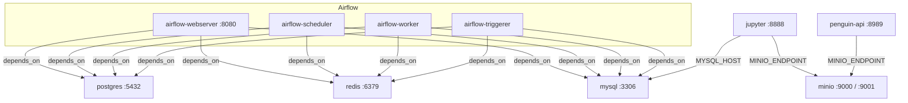

# Infraestructura Docker - Proyecto MLOps

## Descripción General

Esta infraestructura Docker Compose orquesta un entorno completo de MLOps compuesto por servicios de orquestación de flujos de trabajo (Apache Airflow), almacenamiento de datos (MySQL, PostgreSQL), almacenamiento de objetos compatible con S3 (MinIO), notebooks interactivos (Jupyter) y una API de predicciones (penguin-api). Los servicios están interconectados mediante una red Docker interna con dependencias explícitas y verificaciones de salud (healthchecks) para garantizar un arranque ordenado y confiable.

## Tabla de Servicios

| Servicio | Puerto(s) | Propósito | Dependencias |
|----------|-----------|-----------|--------------|
| postgres | 5432 (interno) | Base de datos interna de Airflow | Ninguna |
| redis | 6379 (interno) | Broker Celery para Airflow | Ninguna |
| mysql | 3306 | Base de datos relacional | Ninguna |
| minio | 9000 (API), 9001 (Consola) | Almacenamiento de objetos S3 | Ninguna |
| airflow-webserver | 8080 | Interfaz web de Airflow | postgres, redis, mysql, airflow-init |
| airflow-scheduler | 8974 (interno) | Planificador de DAGs | postgres, redis, mysql, airflow-init |
| airflow-worker | — | Worker Celery | postgres, redis, mysql, airflow-init |
| airflow-triggerer | — | Triggerer de Airflow | postgres, redis, mysql, airflow-init |
| jupyter | 8888 | Notebooks interactivos | mysql, minio |
| penguin-api | 8989 | API de predicciones | minio |

## Diagrama de Conectividad



## Redes Docker

La infraestructura usa tres redes internas para aislar la comunicación entre servicios:

| Red | Servicios | Propósito |
|-----|-----------|-----------|
| `airflow-net` | postgres, redis, mysql, airflow-* | Red interna de Airflow |
| `storage-net` | minio, api | Aísla la API — solo puede ver MinIO |
| `jupyter-net` | mysql, minio, jupyter | Jupyter accede a MySQL y MinIO |

```
airflow-net:  postgres ── redis ── mysql ── airflow-webserver/scheduler/worker/triggerer
storage-net:  minio ── api
jupyter-net:  mysql ── minio ── jupyter
```

`api` está exclusivamente en `storage-net`, por lo que no puede resolver por DNS ningún otro servicio (mysql, postgres, redis, airflow). Solo tiene acceso a `minio`.

## Reglas de Conectividad

| Servicio Origen | Servicio Destino | Tipo de Acceso |
|----------------|-----------------|----------------|
| Airflow (webserver, scheduler, worker, triggerer) | MySQL | Lectura/Escritura vía `AIRFLOW_CONN_MYSQL_DEFAULT` |
| Jupyter | MySQL | Lectura |
| Jupyter | MinIO | Lectura/Escritura |
| penguin-api | MinIO | Lectura/Escritura |

- Airflow SOLO puede comunicarse con MySQL como base de datos externa (además de Postgres y Redis que son internos de Airflow).
- MySQL puede ser LEÍDO por Jupyter.
- Jupyter puede acceder a MinIO para lectura y escritura de objetos.
- penguin-api puede acceder a MinIO para lectura y escritura de modelos y resultados.

## Variables de Entorno por Servicio

### MinIO

| Variable | Valor |
|----------|-------|
| `MINIO_ROOT_USER` | `minio_user` |
| `MINIO_ROOT_PASSWORD` | `minio_password` |

### MySQL

| Variable | Valor |
|----------|-------|
| `MYSQL_ROOT_PASSWORD` | `admin1234` |
| `MYSQL_DATABASE` | `mydatabase` |
| `MYSQL_USER` | `user` |
| `MYSQL_PASSWORD` | `user1234` |

### Jupyter

| Variable | Valor |
|----------|-------|
| `JUPYTER_TOKEN` | `mlops12345` |
| `MYSQL_HOST` | `mysql` |
| `MYSQL_PORT` | `3306` |
| `MYSQL_USER` | `user` |
| `MYSQL_PASSWORD` | `user1234` |
| `MYSQL_DATABASE` | `mydatabase` |
| `MINIO_ENDPOINT` | `minio:9000` |
| `MINIO_ACCESS_KEY` | `minio_user` |
| `MINIO_SECRET_KEY` | `minio_password` |

### Penguin-API

| Variable | Valor |
|----------|-------|
| `MODELS_DIR` | `/app/models` |
| `MINIO_ENDPOINT` | `minio:9000` |
| `MINIO_ACCESS_KEY` | `minio_user` |
| `MINIO_SECRET_KEY` | `minio_password` |

## Instrucciones de Uso

### Levantar la infraestructura completa

```bash
docker compose -f docker/docker-compose.yaml up -d
```

### Detener la infraestructura

```bash
docker compose -f docker/docker-compose.yaml down
```

### Ver logs de un servicio específico

```bash
docker compose -f docker/docker-compose.yaml logs -f [servicio]
```

Ejemplo: `docker compose -f docker/docker-compose.yaml logs -f jupyter`

### Reconstruir imágenes y levantar

```bash
docker compose -f docker/docker-compose.yaml up -d --build
```
